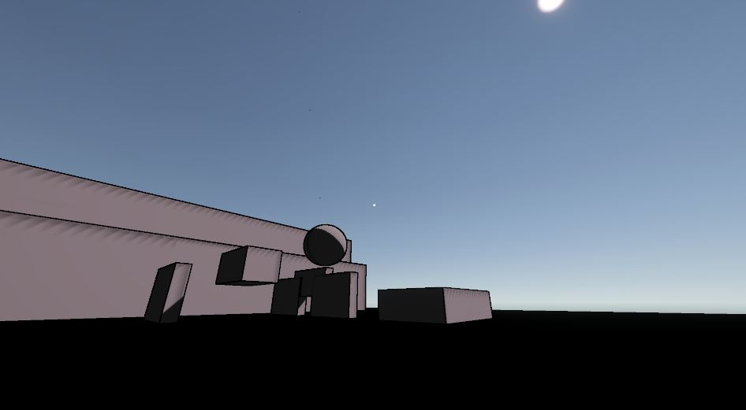
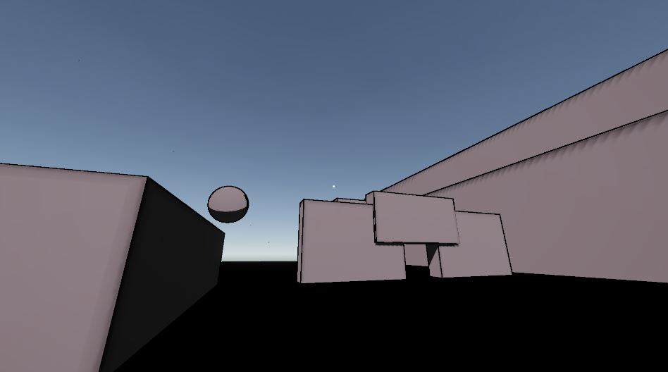
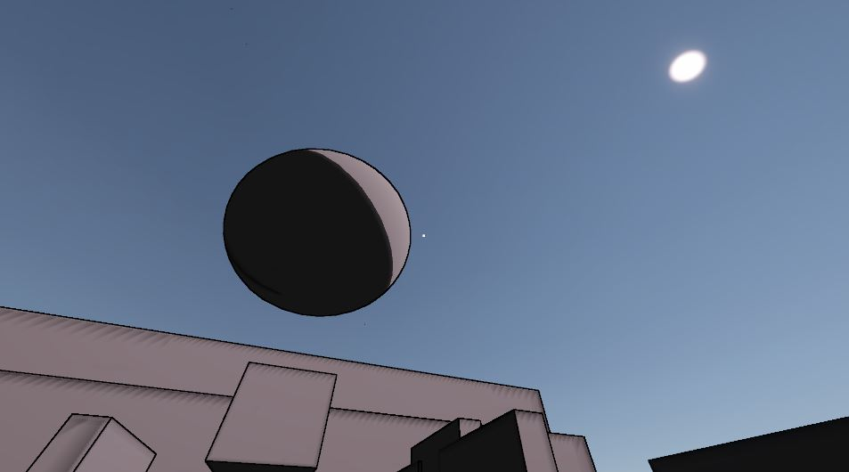
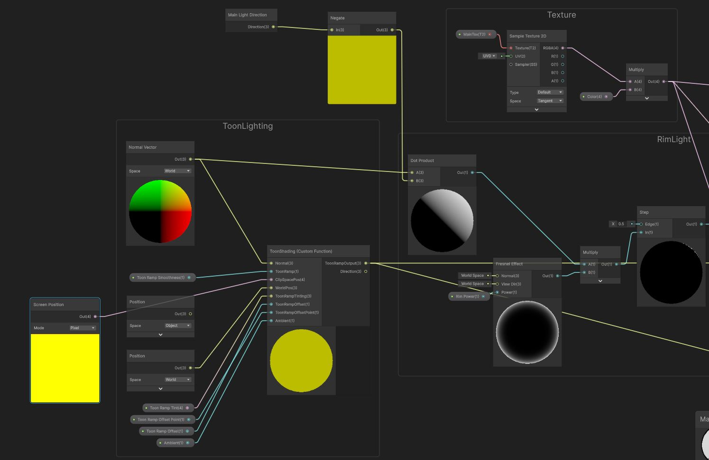
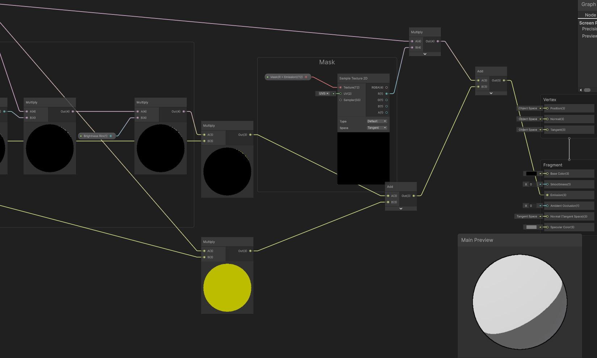
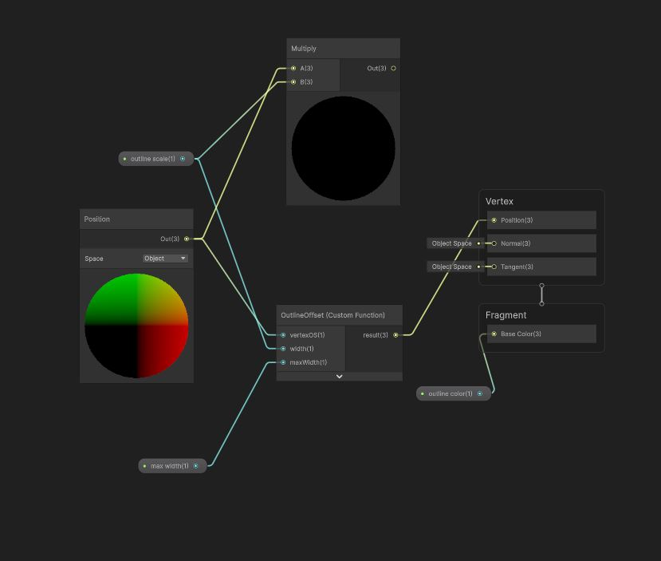

# First-Person Controller + Cel Shading

Unity project. First-person movement system w/ dynamic camera feedback + custom cel/outline shaders.

## Features

- WASD movement
- Sprint
- Jump
- Crouch (toggle)
- Zoom (FOV change)
- Dynamic head bob — intensity scales w/ movement state (sprint = more, crouch = less)
- Cel shading (custom shader)
- Outline shader

## Controls

| Action  | Key            |
|---------|----------------|
| Move    | WASD           |
| Sprint  | Shift (hold)   |
| Jump    | Space          |
| Crouch  | C (toggle)     |
| Zoom    | Right Click    |

## Shaders

Both built in Shader Graph + HLSL Custom Function nodes (URP).

### Cel Shader

Custom toon lighting via `ToonShading` Custom Function node.

- Inputs: Normal, ToonRamp, ClipSpacePos, WorldPos, ToonRampTinting, ToonRampOffset, ToonRampOffsetPoint, Ambient
- Main light direction → dot product w/ world normal → toon ramp lookup (banded diffuse)
- Fresnel-based rim light → step function → sharp rim edge, tunable via Rim Power
- Mask texture (R = Emission) blended in via multiply/add chain
- Main texture sampled + multiplied w/ tint color
- Outputs: Base Color, Smoothness, Emission, Ambient Occlusion, Normal (Tangent Space), Specular Color

### Outline Shader — Edge Detection Post-Process (URP)

Depth + Normal edge detection (Roberts cross operator), full-screen post-process pass via `ScriptableRendererFeature`.

**How it works:**
- Samples 4 diagonal neighbor pixels (bottom-left, top-right, bottom-right, top-left) from depth + camera normals buffers
- Roberts cross: diagonal pair differences detect sharp changes
  - Depth edge — large depth delta = silhouette / sharp geometric edge
  - Normal edge — large normal delta = edge at same depth (e.g. cube corner) that depth alone misses
- Both edge signals combined via `max`, edge color alpha-blended over scene

**Parameters:**

| Param | Function |
|---|---|
| `_Scale` | Edge width (sample point offset in pixels) |
| `_Color` | Edge color + opacity |
| `_DepthThreshold` | Depth detection sensitivity |
| `_DepthNormalThreshold` / `_DepthNormalThresholdScale` | Reduces false-positive edges on surfaces near-parallel to camera (where depth discontinuity naturally increases) |
| `_NormalThreshold` | Normal detection sensitivity |

## Screenshots

